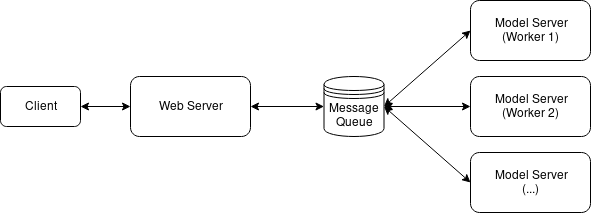

<h1 align="center">Serving Agent</h1>

<p align="center">
A middleware for model serving to speedup online inference.
<a href="./README_zh.md">中文</a>
</p>

<h2 align="center">What is Serving Agent</h2>


Serving Agent is designed as a middleware for model serving between web server and model server to help the server improve the GPU utilization
then speedup online inference.
For the service with machile learning model, the requests from the client are usually streaming.
To utilize the parallel computing capability of GPUs, we usually import a message queue/message broker to cache the request from web server then batch process with model server (the below figure shows the architecture). Serving Agent encapsulates the detial actions that such as serialize the request data, communicate with message queue (redis) and deserialization and more over. With Serving Agent, it is easy to build a scalable service with serveral codes.



<h2 align="center">Installation</h2>

Install ServingAgent by using `pip`，which requires **Python >= 3.5** :
```bash
pip install serving_agent 
```

<h2 align="center">Develop Your service</h2>

1. Define a model such as [TestModel.py](./example/TestModel.py). The `predict` function accepts a batch of inputs. 

```python
import random


class TestModel:
    def __init__(self):
        pass

    def predict(self, inputs):
        return [random.random() for x in inputs]
```

2. Develop a model server as [run_model_server.py](./example/run_model_server.py) and run it.

```python
from serving_agent import ModelAgent

from example.TestModel import TestModel

if __name__ == "__main__":
    model_agent = ModelAgent(redis_broker='localhost:6379', redis_queue='example', model_class=TestModel)
    model_agent.run()
```

```shell
python -m example.run_model_server
```

3. Develop a web server with Flask (or any other Python web framework) and start.

```python
from serving_agent import WebAgent
from flask import Flask, jsonify, request

app = Flask(__name__)
web_agent = WebAgent(redis_broker='localhost:6379', redis_queue='example')


@app.route('/api/test', methods=['POST'])
def test():
    parmas = request.get_json()
    data = parmas['data']
    result = web_agent.process(data)
    return jsonify({'data': result})


if __name__ == '__main__':
    app.run(debug=True)

```

```shell
python -m example.run_web_server
```

Congratulate! You have developed a scalable sevice in serveral minutes!